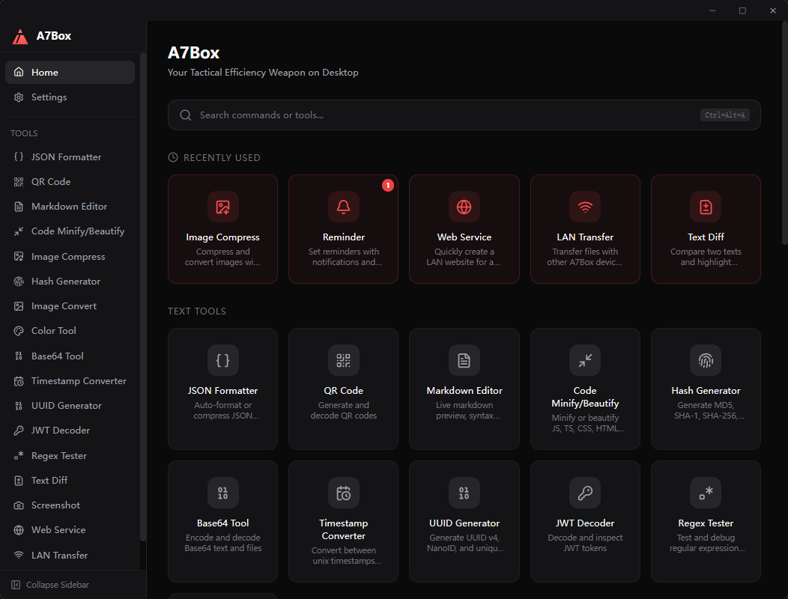

<p align="center">
  
</p>

<h1 align="center">A7Box</h1>

<p align="center">
  <strong>Your Tactical Efficiency Weapon on Desktop</strong><br />
  An open-source, all-in-one developer toolbox that runs 100% locally — no cloud, no tracking, no account required.
</p>

<p align="center">
  <a href="README_zh-CN.md">中文文档</a> · <a href="#tools">Tools</a> · <a href="#-how-it-compares">Comparison</a> · <a href="#download">Download</a> · <a href="#getting-started">Getting Started</a>
</p>

<p align="center">
  
  
  
</p>

<p align="center">
  
</p>

---

## 🔒 Privacy First

A7Box is **100% local**. Every tool — JSON formatting, screenshot capture, hash generation, file compression — runs entirely on your machine. No data ever leaves your computer. No network requests. No telemetry. No account. Just install and use.

In an era where every app wants your data, A7Box respects a simple principle: **your tools should work for you, not against you**.

## 🎯 Who It's For

- **Developers** — JSON formatting, code minification, regex testing, JWT decoding, hash generation, timestamp conversion — the daily toolkit you reach for dozens of times a day
- **Designers** — Pixel-level screen color picker with magnifier overlay, image compression, format conversion, QR code generation
- **Tech Enthusiasts** — LAN file sharing, local web server, screenshot with annotation, Base64 encoding
- **Anyone** who values speed, privacy, and a clutter-free desktop experience

## 💡 Pain Points We Solve

| Problem | A7Box Solution |
|---------|---------------|
| Searching the web for "JSON formatter online" and pasting sensitive data into someone else's server | Built-in JSON formatter — runs locally, your data never leaves |
| Installing 10 separate apps for 10 different tasks | 19 tools in one ~10MB app |
| Taking a screenshot, opening Paint, annotating, saving, then sharing | Region capture → 5 annotation tools → pin to screen → session history, all in one flow |
| Using Electron-based toolboxes that eat 200MB+ RAM | Tauri + Rust backend — ~10MB installer, minimal memory footprint |
| Copying JSON/code, then opening a separate tool to format it | Clipboard quick actions — copy, press shortcut, floating window pops up ready |
| Relying on cloud-based file transfer services for LAN sharing | Built-in P2P LAN transfer and local web server — no third party involved |

## ✨ Core Highlights

- **Cross-Platform** — Native support for Windows, macOS, and Linux from a single codebase
- **100% Local & Offline** — All processing happens on your machine. No internet connection required. No data ever leaves
- **Lightweight** — ~10MB installer, built with Tauri (Rust backend), minimal memory usage, instant startup
- **Secure by Design** — Open-source, auditable, no telemetry, no cloud dependencies
- **Spotlight Command Palette** — Fuzzy search, category filtering, keyboard navigation (`Ctrl+K`) for instant tool access
- **Clipboard Quick Actions** — Copy content, press a shortcut, floating window pops up to process (JSON, code, Markdown, QR)
- **Full Screenshot Workflow** — Capture → annotate (pen/rect/text/mosaic/blur) → pin to screen → session history
- **Pixel-Level Color Picker** — Full-screen transparent overlay with real-time magnifier for precise color sampling
- **LAN Collaboration** — Serve any directory as a website, or P2P transfer files with other A7Box devices
- **System Integration** — Tray icon, right-click context menu (Windows), auto-start on boot, global shortcuts
- **Highly Customizable** — Custom shortcuts, drag-to-reorder modules, dark/light/system theme, i18n (EN/ZH)

## 🧰 Tools

19 built-in tools, accessible via sidebar, command palette (`Ctrl+K`), or customizable global shortcuts.

**Developer Essentials**

| Tool | Description |
|------|-------------|
| **JSON Formatter** | Auto-format, validate, compress, and tree-view JSON data |
| **Code Minify / Beautify** | Minify or beautify JS, TS, CSS, HTML, and JSON |
| **Regex Tester** | Test regular expressions with live matching and highlights |
| **Text Diff** | Side-by-side text comparison with inline diff highlighting |

**Text & Encoding**

| Tool | Description |
|------|-------------|
| **Base64 Tool** | Encode and decode Base64 text and files |
| **Hash Generator** | Generate MD5, SHA-1, SHA-256, SHA-512 hashes |
| **JWT Decoder** | Decode and inspect JWT token headers and payloads |
| **UUID Generator** | Generate UUID v4, NanoID, and unique identifiers |
| **Timestamp Converter** | Convert between Unix timestamps and human-readable dates |

**Design & Media**

| Tool | Description |
|------|-------------|
| **Screenshot** | Region capture with annotation, inline editing, pin preview, and session history |
| **Color Tool** | Screen color picker, format converter, and palette generator |
| **Image Compress** | Browser-side image compression with quality/size control |
| **Image Convert** | Convert between PNG, JPG, and WebP formats |
| **QR Code** | Generate QR codes from text/URL and decode from images |

**Content & Documents**

| Tool | Description |
|------|-------------|
| **Markdown Editor** | Live preview, syntax highlighting, KaTeX math, Mermaid diagrams, HTML export |

**Productivity**

| Tool | Description |
|------|-------------|
| **Reminder** | Local reminders with natural language input, scheduled notifications, and system toasts |
| **Timer** | Countdown & stopwatch with auto-spawn desktop widgets, drag-to-reposition |

**Network**

| Tool | Description |
|------|-------------|
| **Web Service** | Instantly serve any local directory over LAN with file upload support |
| **LAN Transfer** | Peer-to-peer file transfer between A7Box devices on the same network |

## 📊 How It Compares

| Feature | A7Box | DevToys | IT-Tools | He3 | PowerToys | uTools |
|---------|:-----:|:-------:|:--------:|:---:|:---------:|:------:|
| Cross-platform (Win/Mac/Linux) | ✓ | ✓ | — | ✓ (Win/Mac) | ✗ (Win) | ✓ (Win/Mac) |
| 100% local, no cloud | ✓ | ✓ | ✗ | ✓ | ✓ | ✗ |
| Lightweight (<15MB) | ✓ | ✗ | — | ✗ | ✗ | ✗ |
| Clipboard → floating window | ✓ | ✗ | ✗ | ✗ | ✗ | ✓ |
| Screenshot workflow | ✓ | ✗ | ✗ | ✗ | ✗ | ✗ |
| Screen color picker | ✓ | ✗ | ✗ | ✗ | ✓ | ✗ |
| Spotlight command palette | ✓ | ✗ | ✗ | ✗ | ✗ | ✓ |
| LAN file transfer | ✓ | ✗ | ✗ | ✗ | ✗ | ✗ |
| Local web server | ✓ | ✗ | ✗ | ✗ | ✗ | ✗ |
| Reminder & notifications | ✓ | ✗ | ✗ | ✗ | ✗ | ✗ |
| Timer & desktop widgets | ✓ | ✗ | ✗ | ✗ | ✗ | ✗ |
| Global shortcuts | ✓ | ✗ | ✗ | ✓ | ✓ | ✓ |
| Works offline | ✓ | ✓ | ✗ | ✓ | ✓ | ✓ |
| Desktop native app | ✓ | ✓ | ✗ (Web) | ✓ | ✓ | ✓ |
| Auto update | ✓ | ✓ | — | ✓ | ✓ | ✓ |
| i18n (EN/ZH) | ✓ | Partial | ✓ | ✓ | ✓ | ✓ |
| Open source (MIT) | ✓ | ✓ | ✓ | ✗ | ✓ | ✗ |

## 📥 Download

Pre-built installers for **Windows**, **macOS**, and **Linux** are available on the [Releases](https://github.com/bluvenr/a7box/releases) page.

| Platform | Formats |
|----------|---------|
| Windows | `.exe` installer, `.msi` installer, portable `.zip` |
| macOS | `.dmg` (Universal / Intel / Apple Silicon) |
| Linux | `.AppImage`, `.deb` |

The app supports auto-update — once installed, you'll be notified when a new version is available.

### macOS: "App is damaged" Warning

A7Box is not yet signed with an Apple Developer certificate, so macOS Gatekeeper may warn on first launch.

**Quick fix:**

```bash
xattr -cr /Applications/A7Box.app
```

Or go to **System Settings → Privacy & Security → Open Anyway**.

> The app is 100% local, open-source, and auditable. You can verify the source code on GitHub.

## 🎖 The Story Behind A7

The name **A7** is deliberate. Take one of the most iconic engineering symbols in history — the AK-47. Extract its first letter **A** and its last digit **7**. You get **A7**.

Not for what it represents as a weapon, but for what it stands for as engineering:

- **Reliability** — Built to work, every time, without fail
- **Simplicity** — No unnecessary complexity. Pick it up and it just works
- **Efficiency** — Maximum output with minimum overhead

A7Box carries this philosophy into the developer toolbox space: lightweight, no bloat, no compromises. A desktop app that launches instantly, runs quietly, and delivers exactly what you need — the moment you need it.

The **"Box"** completes the picture: one container, a full arsenal of tools. From JSON formatting to screenshots, from file compression to LAN transfer — everything a developer reaches for daily, unified in a single ~10MB application.

That's why our slogan reads: *Your Tactical Efficiency Weapon on Desktop.*

## 🛠 Tech Stack

| Layer | Technology |
|-------|-----------|
| Framework | [Tauri 2](https://tauri.app/) |
| Frontend | [React 19](https://react.dev/) + [TypeScript 5.8](https://www.typescriptlang.org/) |
| Build | [Vite 7](https://vitejs.dev/) |
| Styling | [Tailwind CSS 4](https://tailwindcss.com/) |
| State | [Zustand](https://zustand.docs.pmnd.rs/) |
| i18n | [i18next](https://www.i18next.com/) + [react-i18next](https://react.i18next.com/) |
| Router | [React Router 7](https://reactrouter.com/) |
| Editor | [Monaco Editor](https://microsoft.github.io/monaco-editor/) |
| Backend | [Rust](https://www.rust-lang.org/) (Tauri core + plugins) |

## 🚀 Getting Started

### Prerequisites

- [Node.js](https://nodejs.org/) ≥ 18
- [Rust](https://www.rust-lang.org/tools/install) ≥ 1.77
- [Tauri Prerequisites](https://v2.tauri.app/start/prerequisites/)

### Install

```bash
git clone https://github.com/bluvenr/a7box.git
cd a7box
npm install
```

### Development

```bash
# Start dev server (frontend + Rust backend)
npm run tauri:dev

# Or run frontend only
npm run dev
```

### Build

```bash
npm run tauri:build
```

Installers and executables will be output to `src-tauri/target/release/bundle/`.

## 📂 Project Structure

```
src/
├── app/                  # Layouts, pages, router
├── components/           # Shared UI (Dialog, Toast, TitleBar, etc.)
├── core/                 # Core systems (command palette, i18n, shortcuts, theme, updater)
├── locales/              # i18n translations (en-US, zh-CN)
├── modules/              # 19 tool modules (each self-contained)
├── shared/               # Shared hooks, utils, components
└── styles/               # Global CSS

src-tauri/                # Rust backend
├── src/
│   ├── commands/         # Tauri IPC commands
│   ├── screenshot/       # Screenshot capture engine
│   ├── clipboard/        # Clipboard operations
│   ├── http_server/      # LAN web server
│   ├── p2p/              # P2P file transfer
│   ├── tray/             # System tray
│   └── lib.rs            # App setup & event handlers
└── tauri.conf.json       # Tauri configuration
```

## 📄 License

[MIT](LICENSE) — Free for personal and commercial use.
