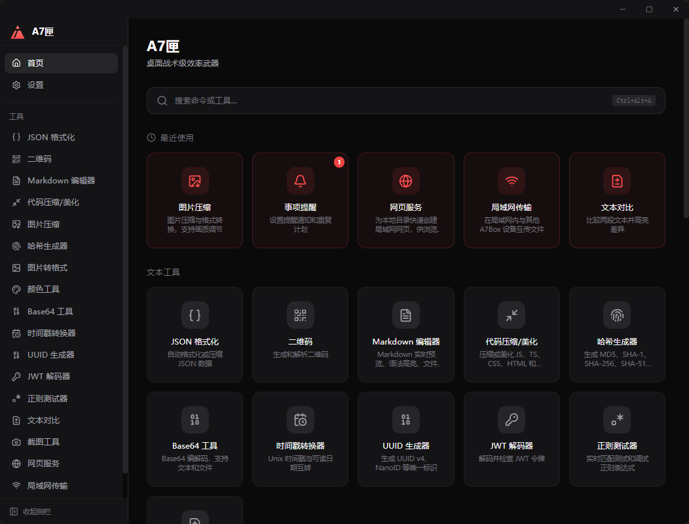

<p align="center">
  
</p>

<h1 align="center">A7Box</h1>

<p align="center">
  <strong>桌面端战术效率武器</strong><br />
  一款开源、全功能的开发者工具箱，100% 本地运行 —— 不联网、不上云、不需要账号。
</p>

<p align="center">
  <a href="README.md">English</a> · <a href="#-工具箱">工具箱</a> · <a href="#-与同类产品对比">对比</a> · <a href="#-下载">下载</a> · <a href="#-快速开始">快速开始</a>
</p>

<p align="center">
  
  
  
</p>

<p align="center">
  
</p>

---

## 🔒 隐私至上

A7Box 是 **100% 本地运行** 的应用。每一款工具 —— JSON 格式化、截图、哈希生成、图片压缩 —— 全部在你的机器上执行。**数据永远不会离开你的电脑**。没有网络请求、没有遥测追踪、不需要注册账号。安装即用。

在一个每个应用都想获取你数据的时代，A7Box 坚守一个简单的原则：**工具应该为你服务，而不是盯着你**。

## 🎯 适合谁

- **开发者** —— JSON 格式化、代码压缩、正则测试、JWT 解码、哈希生成、时间戳转换 —— 你每天要打开几十次的那类工具
- **设计师** —— 像素级屏幕取色器（带放大镜）、图片压缩、格式转换、图片水印、二维码生成
- **技术爱好者** —— 局域网文件分享、本地 Web 服务、截图标注、Base64 编解码
- **任何人** —— 只要你重视速度、隐私和干净的桌面体验

## 💡 我们解决什么问题

| 痛点 | A7Box 方案 |
|------|-----------|
| 搜"在线 JSON 格式化"，把敏感数据粘贴到别人的服务器上 | 内置 JSON 格式化 —— 本地运行，数据不出机器 |
| 为了 10 个不同任务安装 10 个独立应用 | 21 款工具，一个 ~10MB 的应用 |
| 截图 → 打开画图 → 标注 → 保存 → 再分享，流程繁琐 | 区域截图 → 5 种标注工具 → 置顶预览 → 历史记录，一站式完成 |
| 用 Electron 工具箱动辄吃 200MB+ 内存 | Tauri + Rust 后端 —— ~10MB 安装包，极低内存占用，秒启动 |
| 复制 JSON/代码后还要另开工具去格式化 | 剪贴板快捷浮窗 —— 复制 → 快捷键 → 浮窗弹出直接处理 |
| 局域网传文件还得靠云服务中转 | 内置 P2P 局域网传输 + 本地 Web 服务 —— 无需第三方 |

## ✨ 核心亮点

- **跨平台** —— 一套代码，原生支持 Windows、macOS、Linux
- **100% 本地离线** —— 所有处理在你的机器上完成，无需联网，数据不出本机
- **轻量** —— ~10MB 安装包，基于 Tauri（Rust 后端），极低内存占用，秒级启动
- **安全设计** —— 开源可审计，无遥测追踪，无云端依赖
- **Spotlight 命令面板** —— 模糊搜索、分类过滤、键盘导航（`Ctrl+K`），毫秒级触达任意工具
- **剪贴板快捷浮窗** —— 复制内容后按快捷键，浮窗即刻弹出处理（JSON、代码、Markdown、二维码）
- **完整截图工作流** —— 截图 → 标注（画笔/矩形/文字/马赛克/模糊） → 置顶预览 → 历史记录
- **像素级取色器** —— 全屏透明遮罩 + 实时放大镜，精准拾取屏幕任意像素点颜色
- **局域网协作** —— 一键将本地目录变为网站，或与同网络其他 A7Box 设备 P2P 传输文件
- **系统集成** —— 系统托盘、右键菜单（Windows）、开机自启、自定义全局快捷键
- **高度可定制** —— 自定义快捷键、拖拽排序模块、深色/浅色/跟随系统主题、中英双语

## 🧰 工具箱

内置 21 款工具，支持侧边栏、命令面板（`Ctrl+K`）和自定义全局快捷键三种方式调用。

**开发必备**

| 工具 | 说明 |
|------|------|
| **JSON 格式化** | 自动格式化、校验、压缩、树形视图 |
| **代码压缩/美化** | JS、TS、CSS、HTML、JSON 的压缩与美化 |
| **正则测试** | 实时匹配测试正则表达式，高亮匹配结果 |
| **文本对比** | 并排文本比较，行内差异高亮 |

**文本与编码**

| 工具 | 说明 |
|------|------|
| **Base64 工具** | 文本和文件的 Base64 编解码 |
| **哈希生成** | 生成 MD5、SHA-1、SHA-256、SHA-512 哈希值 |
| **JWT 解码** | 解码并查看 JWT 令牌的 Header 和 Payload |
| **UUID 生成器** | 生成 UUID v4、NanoID 及唯一标识符 |
| **时间戳转换** | Unix 时间戳与可读日期互转 |

**设计与图像**

| 工具 | 说明 |
|------|------|
| **截图** | 区域截图、标注编辑（画笔/矩形/文字/马赛克/模糊）、置顶预览、截图记录 |
| **颜色工具** | 屏幕取色器、格式转换、调色板生成 |
| **图片压缩** | 浏览器端图片压缩，支持质量和尺寸控制 |
| **图片转换** | PNG、JPG、WebP 格式互转 |
| **图片水印** | 为图片添加文字、Logo 或时间戳水印，支持平铺、旋转与批量导出 |
| **二维码** | 从文本/URL 生成二维码，从图片解码 |

**内容与文档**

| 工具 | 说明 |
|------|------|
| **Markdown 编辑器** | 实时预览、语法高亮、KaTeX 数学公式、Mermaid 图表、HTML 导出 |

**效率**

| 工具 | 说明 |
|------|------|
| **事项提醒** | 本地提醒，支持自然语言输入、定时通知、系统级弹窗 |
| **计时器** | 倒计时与秒表，自动浮窗、拖拽定位 |

**网络**

| 工具 | 说明 |
|------|------|
| **Web 服务** | 一键将本地目录变为局域网网站，支持文件上传 |
| **局域网传输** | 同网络 A7Box 设备间的 P2P 文件传输 |
| **系统信息** | 实时 CPU、内存、温度、网络与 WiFi、多磁盘存储、多显示器、电池与设备诊断 |

## 📊 与同类产品对比

| 功能 | A7Box | DevToys | IT-Tools | He3 | PowerToys | uTools |
|------|:-----:|:-------:|:--------:|:---:|:---------:|:------:|
| 跨平台 (Win/Mac/Linux) | ✓ | ✓ | — | ✓ (Win/Mac) | ✗ (仅 Win) | ✓ (Win/Mac) |
| 100% 本地，无云端 | ✓ | ✓ | ✗ | ✓ | ✓ | ✗ |
| 轻量 (<15MB) | ✓ | ✗ | — | ✗ | ✗ | ✗ |
| 剪贴板 → 浮窗 | ✓ | ✗ | ✗ | ✗ | ✗ | ✓ |
| 截图工作流 | ✓ | ✗ | ✗ | ✗ | ✗ | ✗ |
| 屏幕取色器 | ✓ | ✗ | ✗ | ✗ | ✓ | ✗ |
| Spotlight 命令面板 | ✓ | ✗ | ✗ | ✗ | ✗ | ✓ |
| 局域网文件传输 | ✓ | ✗ | ✗ | ✗ | ✗ | ✗ |
| 本地 Web 服务 | ✓ | ✗ | ✗ | ✗ | ✗ | ✗ |
| 事项提醒 | ✓ | ✗ | ✗ | ✗ | ✗ | ✗ |
| 计时器与桌面浮窗 | ✓ | ✗ | ✗ | ✗ | ✗ | ✗ |
| 全局快捷键 | ✓ | ✗ | ✗ | ✓ | ✓ | ✓ |
| 离线可用 | ✓ | ✓ | ✗ | ✓ | ✓ | ✓ |
| 桌面原生应用 | ✓ | ✓ | ✗ (Web) | ✓ | ✓ | ✓ |
| 自动更新 | ✓ | ✓ | — | ✓ | ✓ | ✓ |
| 国际化 (中/英) | ✓ | 部分 | ✓ | ✓ | ✓ | ✓ |
| 开源 (MIT) | ✓ | ✓ | ✓ | ✗ | ✓ | ✗ |

## 📥 下载

**Windows**、**macOS** 和 **Linux** 预构建安装包可在 [Releases](https://github.com/bluvenr/a7box/releases) 页面下载。

| 平台 | 格式 |
|------|------|
| Windows | `.exe` 安装包、`.msi` 安装包、便携版 `.zip` |
| macOS | `.dmg`（通用版 / Intel / Apple Silicon） |
| Linux | `.AppImage`、`.deb` |

应用内置自动更新，安装后新版本发布时会收到升级通知。

### macOS："已损坏"提示

A7Box 尚未使用 Apple 开发者证书签名，macOS 安全机制（Gatekeeper）可能在首次启动时提示警告。

**快速修复：**

```bash
xattr -cr /Applications/A7Box.app
```

或前往 **系统设置 → 隐私与安全性 → 仍要打开**。

> 应用 100% 本地运行、开源可审计。你可以在 GitHub 上查看完整源码。

## 🎖 A7 名字由来

**A7** 这个名字，不是随意取的。

取工业史上最具辨识度的工程符号 —— AK-47。提取它的首字母 **A** 与末位数字 **7**，得到 **A7**。

不是在致敬武器本身，而是在提取它所代表的工程精神：

- **可靠** —— 拿起来就能用，用就能成
- **简洁** —— 没有多余的复杂度，上手即会
- **高效** —— 最小开销，最大产出

A7Box 将这种哲学带入开发者工具领域：轻量、无噱头、不妥协。一个即时启动、安静运行、在你需要的那一刻精准交付所需功能的桌面应用。

**"Box"** 则补全了这幅图景：一个容器，一整套武器库。从 JSON 格式化到截图，从图片压缩到局域网传输 —— 开发者日常所需的一切，统一收纳进一个 ~10MB 的应用。

这就是我们 Slogan 的由来：*桌面端战术效率武器。*

## 🛠 技术栈

| 层级 | 技术 |
|------|------|
| 框架 | [Tauri 2](https://tauri.app/) |
| 前端 | [React 19](https://react.dev/) + [TypeScript 5.8](https://www.typescriptlang.org/) |
| 构建 | [Vite 7](https://vitejs.dev/) |
| 样式 | [Tailwind CSS 4](https://tailwindcss.com/) |
| 状态管理 | [Zustand](https://zustand.docs.pmnd.rs/) |
| 国际化 | [i18next](https://www.i18next.com/) + [react-i18next](https://react.i18next.com/) |
| 路由 | [React Router 7](https://reactrouter.com/) |
| 编辑器 | [Monaco Editor](https://microsoft.github.io/monaco-editor/) |
| 后端 | [Rust](https://www.rust-lang.org/)（Tauri 核心 + 插件） |

## 🚀 快速开始

### 环境要求

- [Node.js](https://nodejs.org/) ≥ 18
- [Rust](https://www.rust-lang.org/tools/install) ≥ 1.77
- [Tauri 前置依赖](https://v2.tauri.app/start/prerequisites/)

### 安装

```bash
git clone https://github.com/bluvenr/a7box.git
cd a7box
npm install
```

### 开发

```bash
# 启动开发服务（前端 + Rust 后端）
npm run tauri:dev

# 或仅启动前端开发服务器
npm run dev
```

### 构建

```bash
npm run tauri:build
```

安装包和可执行文件将输出到 `src-tauri/target/release/bundle/`。

## 📂 项目结构

```
src/
├── app/                  # 布局、页面、路由
├── components/           # 共享 UI 组件（Dialog、Toast、TitleBar 等）
├── core/                 # 核心系统（命令面板、i18n、快捷键、主题、更新器）
├── locales/              # 翻译文件（en-US、zh-CN）
├── modules/              # 20 个工具模块（各自独立）
├── shared/               # 共享 hooks、工具函数、组件
└── styles/               # 全局样式

src-tauri/                # Rust 后端
├── src/
│   ├── commands/         # Tauri IPC 命令
│   ├── screenshot/       # 截图捕获引擎
│   ├── clipboard/        # 剪贴板操作
│   ├── http_server/      # 局域网 Web 服务
│   ├── p2p/              # P2P 文件传输
│   ├── tray/             # 系统托盘
│   └── lib.rs            # 应用初始化与事件处理
└── tauri.conf.json       # Tauri 配置
```

## 📄 许可证

[MIT](LICENSE) — 个人和商业使用均免费。
